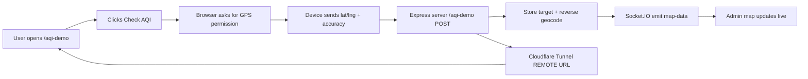
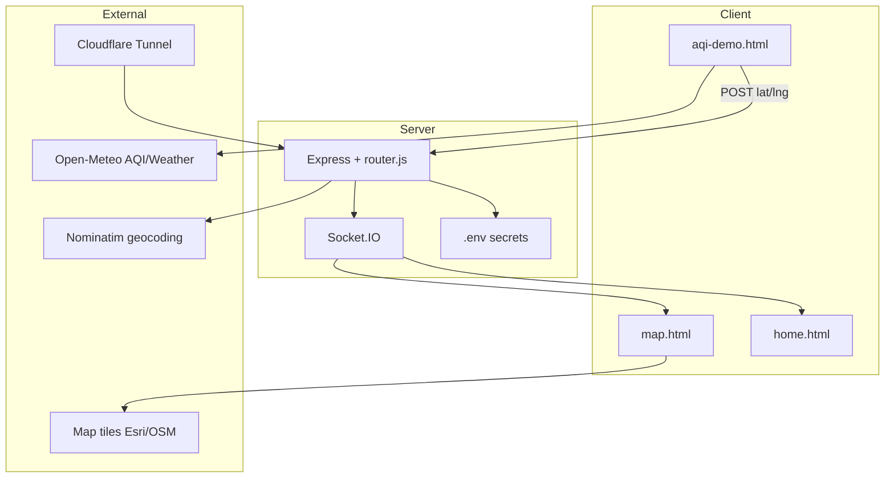

# Live Location Tracker (AQI Checker Demo)

Real-time GPS location tracker with a live Leaflet map and an **Air Quality (AQI) demo page**.  
Built with **Node.js**, **Express**, **Socket.IO**, and a temporary **Cloudflare Tunnel** for remote access.

**Repository:** [deepesh8216/live-location-tracker-by-AQI-checker](https://github.com/deepesh8216/live-location-tracker-by-AQI-checker)

---

## Live Demo

Open the current public demo here:
live-location-tracker-by-aqi-checker-production.up.railway.app

> This is a temporary Cloudflare tunnel URL. It may change when the server restarts.

---

## Features

- AQI demo page that requests location and shows air quality + weather
- Live map view with address, accuracy, and satellite/hybrid layers
- Real-time updates over Socket.IO
- Public shareable link via Cloudflare Tunnel (`REMOTE` URL)
- Login-protected admin dashboard
- Secrets stored in `.env` (not committed to GitHub)

---

## How it works



### Step-by-step flow

1. You run `npm start`. The server starts on localhost and creates a **REMOTE** Cloudflare URL.
2. From the admin home page, copy: `REMOTE_URL/aqi-demo`.
3. The other device opens that link and taps **Check AQI**.
4. The browser asks for location permission.
5. Coordinates are posted to the server every few GPS updates.
6. The server stores the target, looks up an address, and broadcasts updates.
7. On the admin **map** page, the marker and details update in real time.

### Main routes

| Route | Purpose |
|--------|---------|
| `/login` | Admin login |
| `/` | Targets dashboard (protected) |
| `/map?id=...` | Live map for one target (protected) |
| `/aqi-demo` | Public AQI + location demo page |

---

## Architecture



---

## Prerequisites

- **Node.js** v16 or higher
- Internet connection (for tunnel, map tiles, AQI APIs)

---

## Installation

1. **Clone the repository**
```bash
git clone https://github.com/deepesh8216/live-location-tracker-by-AQI-checker.git
cd live-location-tracker-by-AQI-checker
```

2. **Install dependencies**
```bash
npm install
```

3. **Create your secrets file**
```bash
cp .env.example .env
```

Edit `.env` and set:

```env
PORT=6589
ADMIN_USERNAME=your_username
ADMIN_PASSWORD=your_password
AUTH_TOKEN=change_this_to_a_long_random_string
```

> Never commit `.env` to GitHub.

4. **Start the app**
```bash
npm start
```

5. Terminal output example:
```text
LOCAL  : http://localhost:6589
REMOTE : https://random-name.trycloudflare.com
```

- Use **LOCAL** on the same computer  
- Use **REMOTE** to open the demo from another device/network  

---

## Login credentials

Admin username and password are **private** and stored only in your local `.env` file.

For access credentials to this project, contact:

**Email:** [kumardeepesh542@gmail.com](mailto:kumardeepesh542@gmail.com)

---

## Usage

1. Open `LOCAL` or `REMOTE` and log in.
2. Copy the target link shown on the home page (`.../aqi-demo`).
3. Open that link on the device to track and allow location.
4. Click the target ID on the home page to open the live map.

### Tips for accurate GPS

- Enable **Precise location** on the phone
- Prefer outdoors or near a window
- Wait a few seconds for GPS lock (check terminal accuracy like `±20m`)

---

## Project structure

```text
live-location-tracker/
├── server.js          # App entry + Cloudflare tunnel
├── router.js          # Routes, location handling, sockets
├── config.js          # Reads secrets from environment
├── .env.example       # Example env vars (safe to commit)
├── .env               # Real secrets (gitignored)
└── views/
    ├── login.html
    ├── home.html
    ├── map.html
    └── aqi-demo.html
```

---

## Tech stack

- Node.js / Express
- Socket.IO (live updates)
- Leaflet (map UI)
- Cloudflare Tunnel (`cloudflared`) for public URL
- Open-Meteo (AQI + weather)
- OpenStreetMap Nominatim (reverse geocoding)

---

## Security notes

- Keep `.env` private
- Change `AUTH_TOKEN` to a long random string
- The Cloudflare `REMOTE` URL changes every time you restart `npm start`
- Use this project only with consent / for demos and learning

---

## Author

**Deepesh Kumar**  
Email: [kumardeepesh542@gmail.com](mailto:kumardeepesh542@gmail.com)

---

## License

ISC
